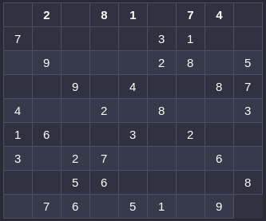
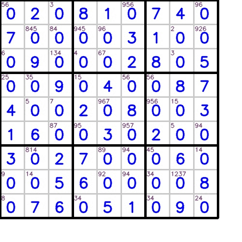

# Visual Sudoku Solver

A simple python program to solve basic sudoku puzzles with a dynamically generated visual interpretation of the internal states of solver algorithm.

## Working

The driver code loads all the puzzles from *sudokus.txt* into a numpy array(9x9)'s list.

Then it iterates over all the puzzles solving each,showing the visualizations, and skipping over after a set threshold number of tries if it can not solve the puzzle.

The visualizations speed in controlled by *speed* variable with time in milliseconds for displaying each state.

The Solver consists of three classes and a driver code. The 3 classes are as follows:

### SudokuValidate

This class is initialize with a **board** containing the sudoku, and its method **getValidator()** returns the validation array required by the SudokuDesign class.

### SudokuDesign

This is responsible to generate all the visual elements for the sudoku using the opencv library.

Its object initialize with two arguments:
* a **board** object that is numpy array of 9x9 containing the sudoku
* a **Validator** object which is numpy array containing 9x9 array containing invalid elements with *value **1*** else *0*

### SudokuSolver

This class implements the solving algorithm. It is initialized with the board's representation in numpy array of 9x9.

It contains two major methods:

* **possibleValues(r,c)** : this method finds out all the possible value at any given cell location in form of row and column coordinates.
* **getSolvedBoard()** : this method simply applies possibleValues() method on each cell in the board, and where-ever it finds only single possible value in any cell, it fills up the cell with it.

## Example

Sample Puzzle given is :

The Iterations of the solver are shown as :

## Limitations

This implements a very basic solving algorithm, hence can only sovle easier puzzlues.
Hence in the driver code we have used **maxtries** threshold that limits the solving and evaluating possible values cycles.

In the 50 sudoku puzzles taken from [here](http://lipas.uwasa.fi/~timan/sudoku/) it solves only 13 puzzles.
